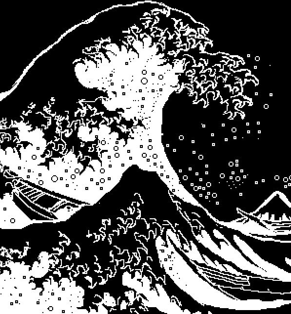

### Hey!

My GitHub is mostly about computational engineering, especially for naval, offshore and coastal applications.

 

Check out some of my projects below:
- [Wave Analysis Toolbox](https://github.com/tdk711/Wave-Analysis-Toolbox) - MATLAB GUI program to obtain spectral and time domain parameters from a sea surface elevation time series
- [3D Parallel Poisson Solver](https://github.com/tdk711/Parallel-Poisson-Solver) - Finite-Difference 3D Cartesian Poisson's Equation Solver parallelized using MPI

Feel free to reach out to me on [LinkedIn](https://www.linkedin.com/in/dilipkumar711/), [Twitter](https://www.twitter.com/tdk_711) or [email](mailto:dilipkumar@smail.iitm.ac.in)

